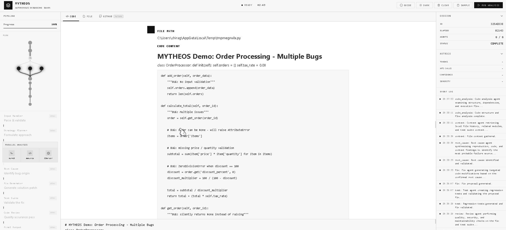
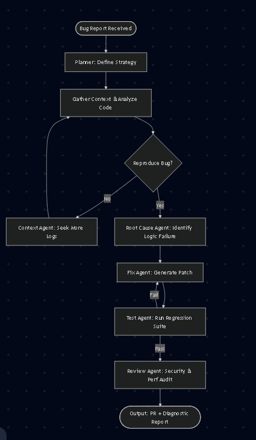
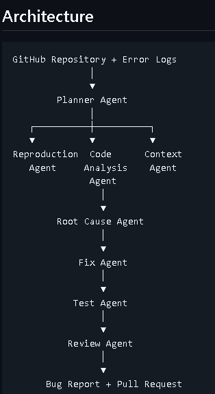
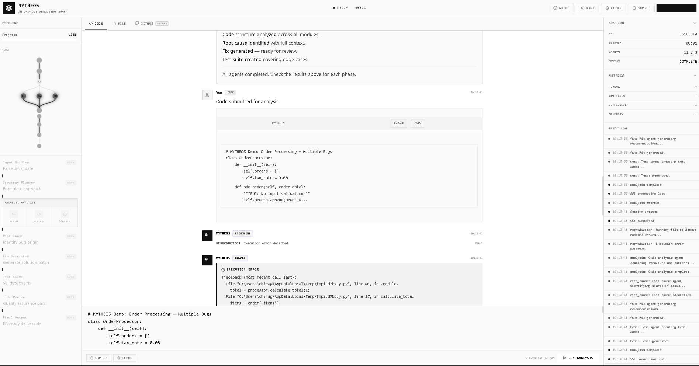
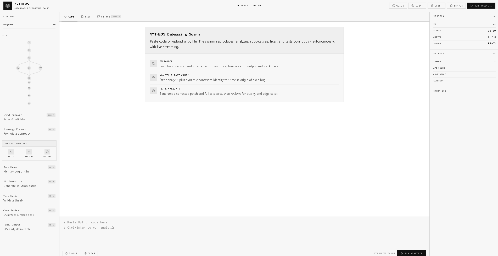
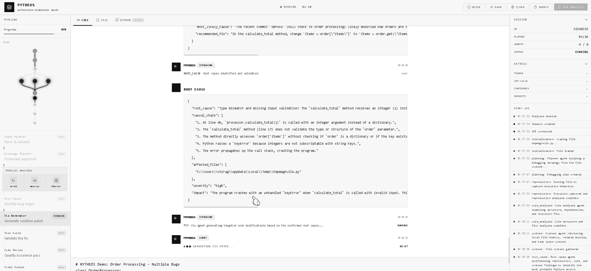
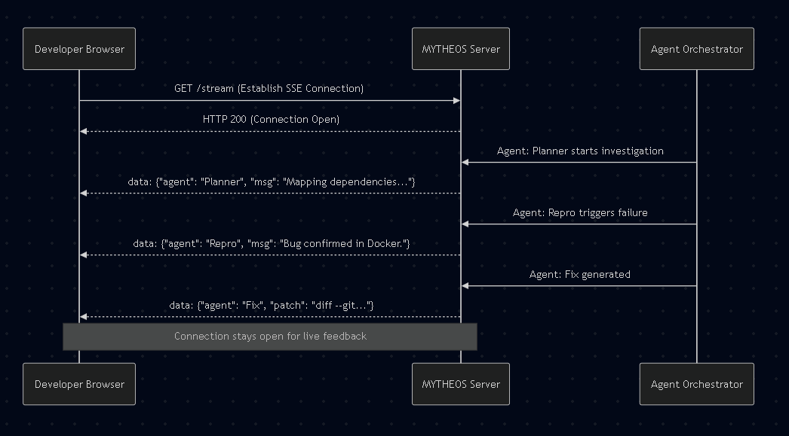

# MYTHEOS

## Multi-Agent Yielding Traceback, Hypothesis, Evaluation, Optimization & Solutions

An autonomous AI debugging swarm that investigates software failures, identifies root causes, generates fixes, validates solutions, and produces pull-request-ready code changes.

---

##  Microsoft Build AI Hackathon Submission

### Submission Details

| Item              | Link                                                              |
| ----------------- | ----------------------------------------------------------------- |
| Live Demo         | https://nice-field-0b1a01600.7.azurestaticapps.net                |
| Demo Video        | https://youtu.be/QkcsxBdOckE                                      |
| GitHub Repository | https://github.com/ChiragSindhu/mytheos_microsoftbuildaihackathon |
| Presentation Deck | Included in Hackathon Submission                                  |
| Theme             | Agent Swarms                                                      |
| Team              | Chirag Sindhu                                                     |

---

# Problem Statement

Modern software engineering teams spend a significant amount of time debugging applications.

A typical debugging workflow requires engineers to:

* Analyze logs and stack traces
* Reproduce failures
* Understand repository architecture
* Trace execution paths
* Identify root causes
* Generate fixes
* Create regression tests
* Validate solutions
* Prepare pull requests

Existing AI coding assistants primarily generate code but do not perform a complete debugging lifecycle.

MYTHEOS solves this challenge through a coordinated swarm of specialized AI agents capable of autonomously diagnosing and repairing software defects.

---

# What is MYTHEOS?

MYTHEOS (Multi-Agent Yielding Traceback, Hypothesis, Evaluation, Optimization & Solutions) is an autonomous debugging platform powered by collaborative AI agents.

Instead of relying on a single LLM response, MYTHEOS orchestrates multiple specialized agents that investigate a bug from different perspectives and collaboratively determine the optimal solution.

The system mimics the workflow of an experienced engineering team.

---

# Key Features
Repository Analysis
Automated Bug Investigation
Stack Trace Understanding
Context-Aware Code Search
Root Cause Detection
Autonomous Fix Generation
Regression Test Creation
Patch Validation
Pull Request Ready Output
Multi-Agent Collaboration
---

# Agent Swarm Architecture

## Planner Agent

Creates debugging strategy.

Responsibilities:

* Understand issue description
* Parse repository structure
* Define investigation plan
* Coordinate task allocation

---

## Reproduction Agent

Attempts to reproduce failures.

Responsibilities:

* Run failing code
* Execute tests
* Capture logs
* Generate reproduction evidence

---

## Code Analysis Agent

Performs static and structural analysis.

Responsibilities:

* Dependency analysis
* Function tracing
* Call graph generation
* Impact assessment

---

## Context Agent

Collects supporting information.

Responsibilities:

* Documentation retrieval
* Git history analysis
* Previous pull request lookup
* Related issue discovery

---

## Root Cause Agent

Synthesizes findings.

Responsibilities:

* Correlate evidence
* Generate hypotheses
* Identify probable failure source
* Assign confidence scores

---

## Fix Agent

Produces code modifications.

Responsibilities:

* Generate patches
* Refactor problematic logic
* Suggest alternative implementations

---

## Test Agent

Validates generated fixes.

Responsibilities:

* Generate regression tests
* Execute validation runs
* Verify bug resolution

---

## Review Agent

Final quality gate.

Responsibilities:

* Security review
* Performance review
* Maintainability review
* Best-practice validation

---

# System Workflow

Issue Report
↓
Planner Agent
↓
Reproduction Agent
↓
Code Analysis Agent
↓
Context Agent
↓
Root Cause Agent
↓
Fix Agent
↓
Test Agent
↓
Review Agent
↓
Final Patch & Report

---

# Technology Stack

## Frontend

* Javascript
* HTML
* Tailwind CSS

## Backend

* Python
* FastAPI

## Agent Infrastructure

* Agentic AI
* Multi-Agent Orchestration

## Messaging & Coordination

* RabbitMQ
* Redis

## AI Components

* Azure OpenAI
* LLM-powered Agents

## Deployment

* Azure Static Web Apps
* Azure Cloud Services

---

# Inputs

MYTHEOS accepts:

* GitHub Repository URL
* Local Source Code
* Bug Reports
* Error Logs
* Stack Traces
* Failed Test Cases

---

# Outputs

MYTHEOS produces:

* Root Cause Analysis
* Investigation Timeline
* Evidence Report
* Suggested Fixes
* Generated Tests
* Validation Results
* Confidence Scores
* Pull Request Ready Patch

---

# Why Agent Swarms?

Traditional AI systems rely on a single reasoning chain.

MYTHEOS distributes reasoning across specialized agents, enabling:

* Better fault isolation
* Parallel investigation
* Evidence-based decision making
* Increased debugging reliability
* Improved explainability

This swarm-based approach closely mirrors how engineering teams collaboratively solve production incidents.

---

# Demo Screenshots

## Dashboard

---

## Repository Analysis

---

## Agent Swarm Execution

---

## Root Cause Analysis

---

## Generated Fix

---

## Regression Testing

---

## Validation Report

---

# Future Enhancements

* GitHub Pull Request Integration
* Azure DevOps Integration
* Jira Integration
* Kubernetes Incident Analysis
* Autonomous Patch Deployment
* Long-Term Agent Memory
* Enterprise Multi-Repository Debugging

---

# Impact

MYTHEOS demonstrates how AI Agent Swarms can automate complex engineering workflows beyond code generation.

By combining investigation, reasoning, validation, and remediation into a unified autonomous system, MYTHEOS reduces debugging time, improves software reliability, and showcases the future of collaborative AI engineering systems.

---

# Authors

Chirag Sindhu

Microsoft Build AI Hackathon 2026 Submission
